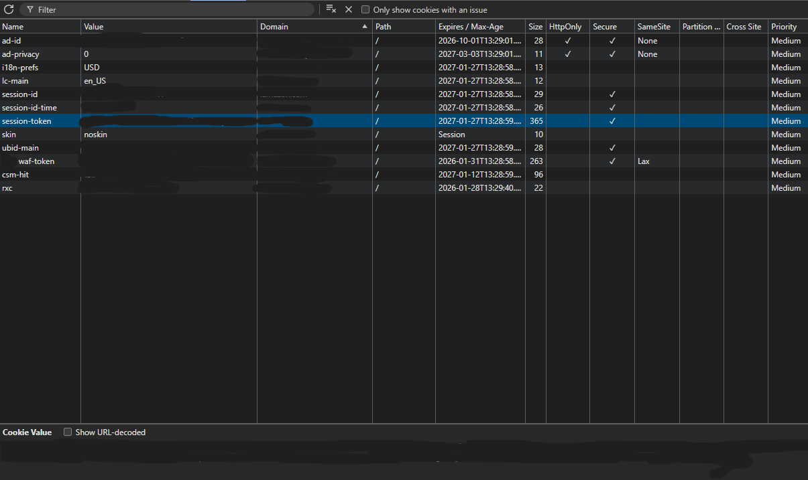
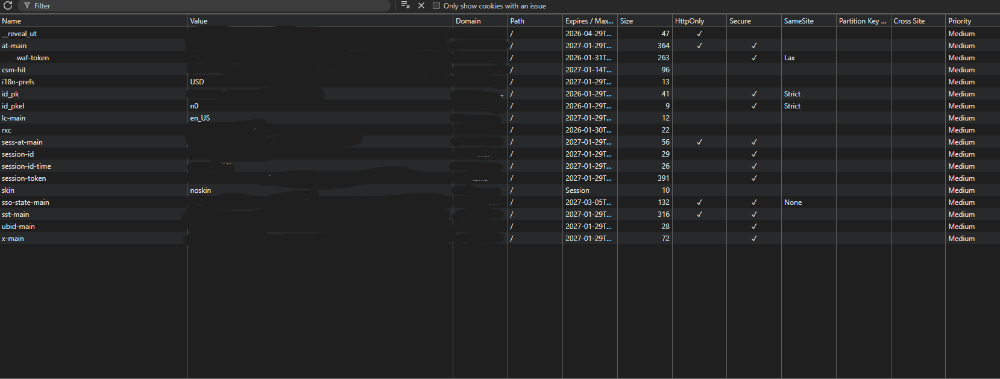

# How Do Cookies Work?

## Overview

A look into Cokies, their security attributes, and real-world analysis of how major a website implement them.

---

## Table of Contents

- [What Are Cookies?](#what-are-cookies)
- [How Cookies Work](#how-cookies-work)
- [Security Attributes](#security-attributes)
- [Hands-On Analysis](#hands-on-analysis)
- [Security Implications](#security-implications)
- [What I Learned](#what-i-learned)
- [Resources](#resources)

---

## What Are Cookies?

Cookies are small pieces of data (key-value pairs) that a web server sends to a user's browser. The browser stores them and automatically sends them back with every subsequent request to the same server.

---

## How Cookies Work

### Step 1: Server Sets a Cookie

When you log in or visit a site, the server includes a `Set-Cookie` header in the HTTP response:

```http
HTTP/1.1 200 OK
Set-Cookie: sessionId=abc123; Expires=Wed, 09 Jun 2026 10:18:14 GMT; Secure; HttpOnly; SameSite=Strict
Content-Type: text/html
```

### Step 2: Browser Stores Cookie

The browser saves this cookie to your local machine and it is associated with the domain that set

### Step 3: Browser Sends Cookie Back

On every subsequent request to that domain, the browser automatically includes the cookie:

```http
GET /dashboard HTTP/1.1
Host: example.com
Cookie: sessionId=abc123
```

### Step 4: Server Reads and Responds

The server reads the cookie, identifies the user/session, and responds accordingly.

This is how when you go back to a site that you set to dark theme or never sign out of, it remembers the theme and your last session with you still signed in.

### Visual Flow

```
┌──────────────┐                          ┌──────────────┐
│   Computer/  │  1. Login Request        │              │
│   Browser    │ ───────────────────────► │    Server    │
│              │                          │              │
│              │  2. Response +           │              │
│              │     Set-Cookie: session  │              │
│              │ ◄─────────────────────── │              │
│              │                          │              │
│  [Stores     │  3. Subsequent Request   │              │
│   Cookie]    │     Cookie: session      │              │
│              │ ───────────────────────► │  [Validates  │
│              │                          │   Cookie]    │
│              │  4. Authorized Response  │              │
│              │ ◄─────────────────────── │              │
└──────────────┘                          └──────────────┘
```

---

## Security Attributes

| Attribute | Purpose | Security Impact |
|-----------|---------|-----------------|
| `HttpOnly` | When set, browsers keep the cookie out of JavaScript APIs | Makes it harder for XSS attacks to steal session cookies or other sensitive data |
| `Secure` | Prevents cookies from being transmitted in clear text | Prevents interception via man-in-the-middle attacks |
| `SameSite` | Prevents browser from sending this cookie along with cross-site requests | Mitigates the risk of cross-origin information leakage and CSRF attacks |

---

## Hands-On Analysis

### Testing Methodology

I analyzed cookies on a major e-commerce website to understand real-world implementations.

---

### Test 1: Inspecting Cookies via DevTools (Pre-Login)

#### Summary Table (Sanitized)

| Cookie | HttpOnly | Secure | SameSite | Security Assessment |
|--------|----------|--------|----------|---------------------|
| session-token | ❌ | ❌ | (none) | ⚠️ Accessible to JS |
| session-id | ❌ | ❌ | (none) | ⚠️ Accessible to JS |
| waf-token | ❌ | ✅ | Lax | Partial protection |
| ad-id | ✅ | ✅ | None | ✅ Well protected |
| i18n-prefs | ❌ | ❌ | (none) | ✅ Non-sensitive |

#### Screenshot (Sanitized)



*Note: Cookie values have been redacted for security. The key observation is the HttpOnly and Secure columns.*

#### Detailed Analysis

```
┌─────────────────────────────────────────────────────────────────────────────────┐
│ Cookie Analysis - E-Commerce Website (Pre-Login)                                │
├──────────────────┬──────────────────┬──────────┬──────────┬──────────┬─────────┤
│ Name             │ Value            │ HttpOnly │ Secure   │ SameSite │ Purpose │
├──────────────────┼──────────────────┼──────────┼──────────┼──────────┼─────────┤
│ session-token    │ [REDACTED]       │ ❌       │ ❌       │ (none)   │ Auth    │
│ session-id       │ [REDACTED]       │ ❌       │ ❌       │ (none)   │ Session │
│ waf-token        │ [REDACTED]       │ ❌       │ ✅       │ Lax      │ WAF     │
│ ad-id            │ [REDACTED]       │ ✅       │ ✅       │ None     │ Ads     │
│ i18n-prefs       │ USD              │ ❌       │ ❌       │ (none)   │ Prefs   │
│ lc-main          │ en_US            │ ❌       │ ❌       │ (none)   │ Prefs   │
│ skin             │ noskin           │ ❌       │ ❌       │ (none)   │ UI      │
└──────────────────┴──────────────────┴──────────┴──────────┴──────────┴─────────┘

Key Finding: Authentication cookies lack HttpOnly protection ⚠️
```

---

### Test 2: Inspecting Cookies via DevTools (Post-Login)

#### New Cookies After Login

| Cookie | Appeared After Login | Protected |
|--------|---------------------|-----------|
| at-main | ✅ Yes | ✅ HttpOnly + Secure |
| sess-at-main | ✅ Yes | ✅ HttpOnly + Secure |
| sso-state-main | ✅ Yes | ✅ HttpOnly + Secure |
| sst-main | ✅ Yes | ✅ HttpOnly + Secure |
| x-main | ✅ Yes | ⚠️ Secure only |
| id_pk | ✅ Yes | ⚠️ Secure only |
| id_pkel | ✅ Yes | ⚠️ Secure only |
| _reveal_ut | ✅ Yes | ❌ Neither |

**Observation:** Login adds several new authentication cookies. The SSO-related cookies (at-main, sst-main, etc.) are protected with HttpOnly, while session-token remains not set.

#### Screenshot (Sanitized)



---

## Security Implications

### Security Assessment Summary

```
┌────────────────────────────────────────────────────────────────┐
│                    COOKIE SECURITY OVERVIEW                    │
├────────────────────────────────────────────────────────────────┤
│                                                                │
│  WELL PROTECTED (HttpOnly + Secure)                            │
│  ├── at-main           ✅ Primary auth token                   │
│  ├── sess-at-main      ✅ Session auth token                   │
│  ├── sso-state-main    ✅ SSO state                            │
│  └── sst-main          ✅ SSO token                            │
│                                                                │
│  PARTIALLY PROTECTED (Secure only, no HttpOnly)                │
│  ├── session-token     ⚠️  Main session - JS accessible        │
│  ├── x-main            ⚠️  Auth related - JS accessible        │
│  ├── ubid-main         ⚠️  Browser ID - JS accessible          │
│  ├── id_pk             ⚠️  Identity - JS accessible            │
│  └── id_pkel           ⚠️  Identity flag - JS accessible       │
│                                                                │
│  MINIMAL PROTECTION                                            │
│  ├── session-id        ❌ No HttpOnly, No Secure               │
│  ├── session-id-time   ❌ No HttpOnly, No Secure               │
│  └── csm-hit           ❌ No HttpOnly, No Secure               │
│                                                                │
│  NON-SENSITIVE (Protection not required)                       │
│  ├── i18n-prefs        ℹ️  Just "USD"                          │
│  ├── lc-main           ℹ️  Just "en_US"                        │
│  └── skin              ℹ️  Just "noskin"                       │
│                                                                │
├────────────────────────────────────────────────────────────────┤
│  KEY INSIGHT: Site uses MULTIPLE auth mechanisms               │
│  Some are properly protected, suggesting layered security      │
└────────────────────────────────────────────────────────────────┘
```

---

## What I Learned

This was fun but not nearly as tasty as I was hoping when I heard about Cookies. 🍪

I learned that cookies are a way for websites to store information about your session on your local machine. This allows you to set certain site preferences and when you go back to that site those changes remain intact. For example, if you set your website to dark mode and then close the browser, when you go back, that site still displays in dark mode.

From the security point of view I learned that even though there are best practices they don't fit for every situation. I learned that though it appears that things may be easy to obtain such as a session-tokens by running some JavaScript, most places have or at least should have other measures in place to mitigate these types of attacks. Security is like an onion, it should have many layers. 

---

## Resources

- [Kaspersky: What Are Cookies?](https://www.kaspersky.com/resource-center/definitions/cookies)
- [OWASP Foundation](https://owasp.org)
- [OWASP Session Management Cheat Sheet](https://cheatsheetseries.owasp.org/cheatsheets/Session_Management_Cheat_Sheet.html)
- [MDN: HTTP Cookies](https://developer.mozilla.org/en-US/docs/Web/HTTP/Cookies)
